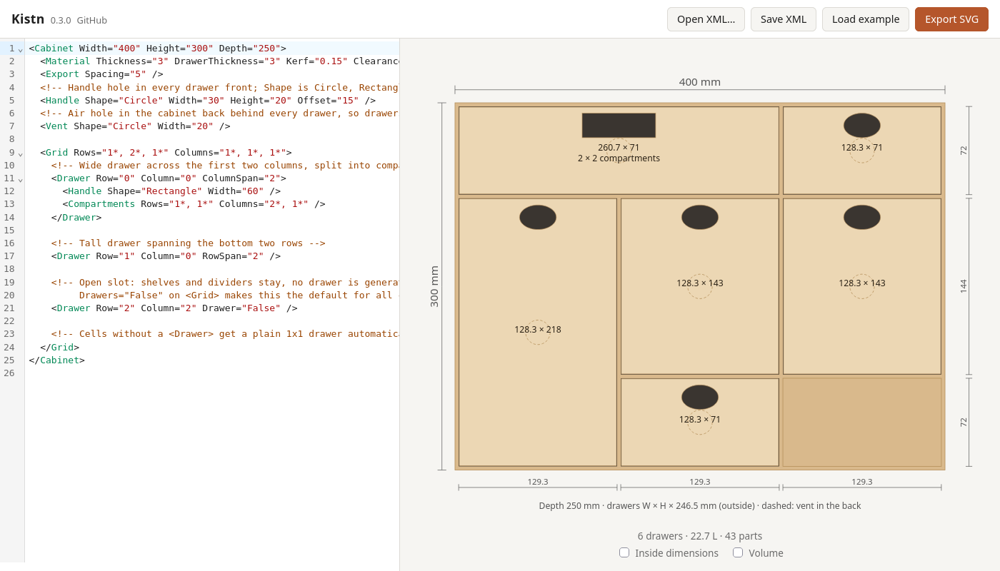

# Kistn

Kistn designs laser-cut drawer cabinets in the browser. You describe the cabinet in a short XML file, watch the live front view, and export an SVG for the laser cutter.



## Features

- Finger-jointed cabinet with shelves and dividers on a grid; drawers can span several cells
- Drawer boxes with optional compartments and handle holes, vent holes in the cabinet back, open slots without a drawer
- Live front view with dimensions, inside sizes and volumes
- SVG export in millimetres with kerf compensation and separate Inkscape layers for cuts and part labels

## Example

```xml
<Cabinet Width="400" Height="300" Depth="250">
  <Material Thickness="3" Kerf="0.15" Clearance="0.5" FingerWidth="10" />
  <Handle Shape="Circle" Width="30" Height="20" Offset="15" />
  <Vent Shape="Circle" Width="20" />
  <Grid Rows="1*, 2*" Columns="1*, 1*">
    <Drawer Row="0" Column="0" ColumnSpan="2" />
  </Grid>
</Cabinet>
```

All sizes are in millimetres. **Load example** in the app gives a commented example with every element. The [changelog](CHANGELOG.md) explains each option.

## Development

Requires Node.js.

```sh
npm install
npm run dev    # or ./run.sh, which also loads nvm and opens the browser
npm test
```

`./publish.sh <target-dir> [base-path]` runs the tests, builds the app and copies the static site into a web server directory.
